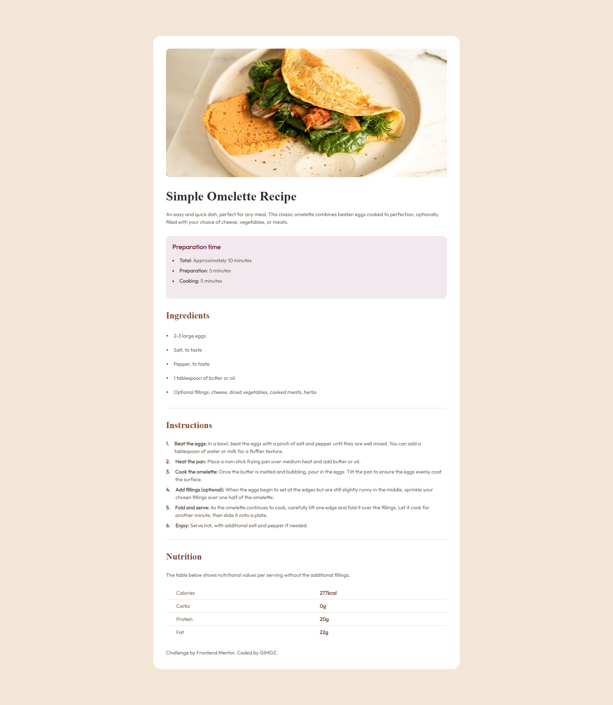
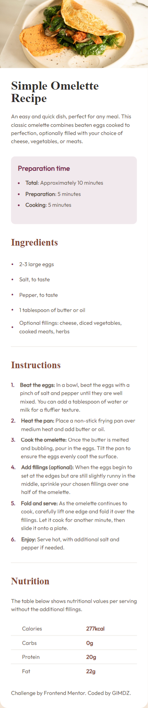

# Frontend Mentor - Recipe page solution

This is a solution to the [Recipe page challenge on Frontend Mentor](https://www.frontendmentor.io/challenges/recipe-page-KiTsR8QQKm). Frontend Mentor challenges help you improve your coding skills by building realistic projects. 

## Table of contents

- [Overview](#overview)
  - [The challenge](#the-challenge)
  - [Screenshot](#screenshot)
  - [Links](#links)
- [My process](#my-process)
  - [Built with](#built-with)
  - [Continued development](#continued-development)
  - [Useful resources](#useful-resources)
- [Author](#author)

## Overview

### Screenshot

### Links

- Solution URL: [Add solution URL here](https://github.com/GIMDZ/FM-Recipe-page)
- Live Site URL: [Add live site URL here](https://fm-recipe-page-mu.vercel.app/)

## My process

### Built with

- Semantic HTML5 markup
- CSS custom properties
- Tailwind
- Mobile-first workflow

### Continued development

I would like to handle fonts better so I'll focus on that in the upcoming projects.

### Useful resources

- [Deploy Tailwind CSS project to cPanel, GitHub, Netlify, Vercel](https://www.youtube.com/watch?v=Z47liG3OWdk) - This helped me deploy the site using Vercel. 
- [Customizing List Style Position](https://www.csshunter.com/tailwind-css-list-style-position/) - This is an article helped me understand how to style a list with Tailwind.
- [The Markdown Guide](https://www.markdownguide.org/) - This helped me with the README file.

## Author

- Github - [Giannina Miñano](https://github.com/GIMDZ)
- Frontend Mentor - [@GIMDZ](https://www.frontendmentor.io/profile/GIMDZ)

